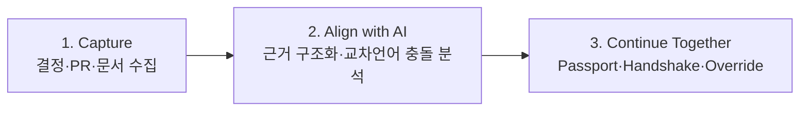
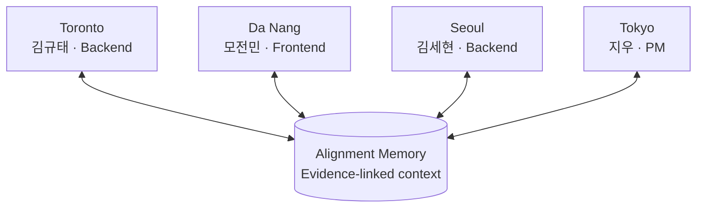
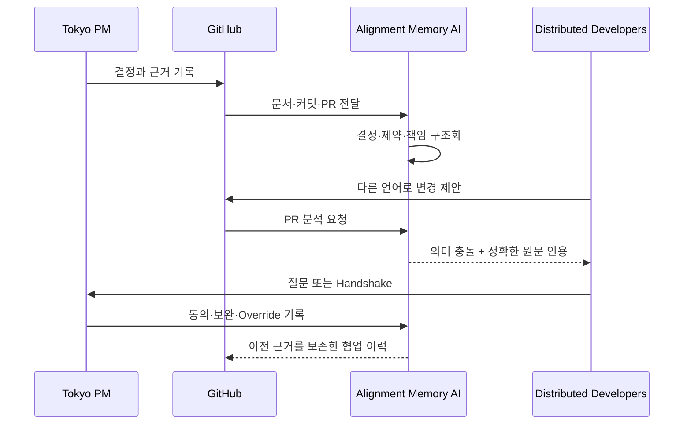

# Alignment Memory

> **결정은 번역되어도, 맥락은 쉽게 사라집니다.**

Alignment Memory는 서로 다른 시간대와 언어에서 일하는 팀이 **GitHub의 결정과 변경을 같은 근거 위에서 이해하도록 만드는 AI 협업 메모리**입니다.

한국어로 남긴 결정과 다른 언어의 Pull Request를 AI가 의미 단위로 비교하고, 정확한 원문 근거와 함께 충돌을 설명합니다. AI가 결론을 대신 내리지는 않습니다. 팀원은 `Context Passport`로 같은 맥락을 확인하고 `Handshake`와 `Override`로 최종 판단을 기록합니다.

[라이브 데모](https://alignment-memory-fe.vercel.app) · [Backend](https://github.com/gyutaetae/alignment-memory-be) · [API 상태](https://alignment-memory-be-production.up.railway.app/healthz)

## 30초 만에 이해하기



1. PM이 GitHub에 한국어로 개인정보 보호 결정을 남깁니다.
2. 다른 시간대의 개발자가 영어로 원문 로그 저장을 제안합니다.
3. AI가 두 문장의 의미 충돌을 찾고 한국어 원문을 정확히 인용합니다.
4. 각 팀원은 원하는 언어와 자신의 업무 맥락으로 결과를 확인합니다.
5. 사람이 질문·동의·교정을 남기고, 이전 기록도 그대로 보존합니다.

## 우리가 넘는 네 가지 경계

| 경계 | 실제 협업 | 제품이 유지하는 맥락 |
| --- | --- | --- |
| **지리** | 토론토·다낭·서울·도쿄에서 비동기 협업 | 시간대·역할·담당 범위를 담은 Context Passport |
| **언어** | 한국어·영어·일본어·베트남어 사용 | 원문을 보존하며 교차언어 의미 충돌 분석 |
| **문화** | 서로 다른 업무 시간과 직무 관점 | 국적을 추측하지 않고 사용자가 선택한 언어와 자기 선언 맥락 사용 |
| **조직** | 한 해커톤 팀 안의 PM·프론트엔드·백엔드 협업 | 결정·구현·검토·Handshake를 GitHub 근거로 연결 |

회사가 다른 것처럼 과장하지 않습니다. Alignment Memory가 이번 프로젝트에서 실제로 넘은 조직 경계는 **한 팀 안의 직무와 책임 경계**입니다.

## Figure 1. 네 도시, 하나의 프로젝트 맥락



지역이나 국적만으로 언어·문화·업무 방식을 추측하지 않습니다. 역할과 표시 언어는 사용자가 직접 선택하며, 네 언어는 서로 독립적으로 전환할 수 있습니다.

## Figure 2. 제품 흐름



## 주요 화면

| 화면 | 확인할 수 있는 것 |
| --- | --- |
| **Project Memory** | 결정, 요구사항, 위험, 최근 Alignment와 작업 상태 |
| **Alignment Diff** | 기존 결정과 제안된 변경의 의미 차이 |
| **Verified Evidence** | AI 판정이 인용한 정확한 원문과 GitHub 링크 |
| **Knowledge Graph** | 목표·결정·작업·위험 사이의 관계 |
| **Context Passport** | 역할·시간대·담당 범위와 선택 언어에 맞춘 인수인계 맥락 |
| **Handshake / Override** | 사람의 동의·질문·반대 및 근거 있는 최종 교정 |

## Figure 3. AI가 핵심인 이유

| AI가 수행 | 일반 코드가 검증 | 사람이 결정 |
| --- | --- | --- |
| 서로 다른 언어의 의미 비교 | 인용문이 실제 원문에 존재하는지 검증 | `agree`, `needs clarification`, `disagree` 선택 |
| 결정·제약·책임 구조화 | 스키마·권한·중복·게시 경로 검증 | AI 오판 또는 기존 결정 변경 사유 기록 |
| 역할별 Context Passport 생성 | 이전 근거와 판정을 삭제하지 않고 보존 | 최종 합의와 다음 행동 승인 |

키워드 규칙이나 번역만으로는 “원문 메시지를 저장하지 않는다”와 “디버깅을 위해 원문을 저장한다” 사이의 의미 충돌을 안정적으로 찾기 어렵습니다. 그래서 AI는 장식이 아니라 **맥락을 연결하는 핵심 분석 계층**입니다.

## 실제 협업 팀

| 팀원 | 역할 | 작업 지역 | 주요 기여 |
| --- | --- | --- | --- |
| 김규태 | Backend | Toronto, Canada | 추후 팀원이 직접 작성 |
| 모전민 | Frontend | Da Nang, Vietnam | 추후 팀원이 직접 작성 |
| 김세현 | Backend | Seoul, Korea | 추후 팀원이 직접 작성 |
| 지우 | Product Manager | Tokyo, Japan | 추후 팀원이 직접 작성 |

실제 협업에서 한국어·영어·일본어·베트남어를 사용했습니다. 주요 기여와 공개 가능한 기획·디자인·개발 근거는 팀원이 직접 확인한 뒤 추가합니다.

## 실행하기

요구 환경: Node.js `20.19+` 또는 `22.12+`

### 계정 없이 UI 둘러보기

```bash
npm ci
VITE_FIXTURE_MODE=true npm run dev
```

브라우저에서 `http://127.0.0.1:5173`을 열면 됩니다. Fixture는 제품 흐름을 재현하지만 외부 GitHub·OpenAI·Supabase를 호출한 라이브 증거는 아닙니다.

### Live API 연결

```bash
cp .env.example .env.local
npm ci
npm run dev
```

`.env.local`에 실제 Backend, Supabase, GitHub App 공개 설정을 입력합니다. `VITE_FIXTURE_MODE=true`를 설정하면 API 주소가 있어도 Fixture가 우선됩니다.

| 환경 변수 | 설명 |
| --- | --- |
| `VITE_API_BASE_URL` | Alignment Memory Backend URL |
| `VITE_SUPABASE_URL` | Supabase Auth URL |
| `VITE_SUPABASE_PUBLISHABLE_KEY` | 브라우저용 Supabase 공개 키 |
| `VITE_GITHUB_APP_INSTALL_URL` | GitHub App 설치 URL |
| `VITE_FIXTURE_MODE` | `true`일 때 외부 계정 없는 UI Fixture 사용 |

## 검증

```bash
npm run lint
npm test -- --run
npm run build
```

현재 로컬 기준: 테스트 6개 통과. 배포 전에는 Vercel 화면뿐 아니라 Backend health, GitHub Actions 분석, 원문 링크, Handshake 저장까지 확인합니다.

## 프로젝트 구조

```text
src/
├── repositories/   GitHub 연결과 Initial Sync
├── dashboard/      Project Memory
├── alignment/      Alignment Diff와 검증 근거
├── graph/          Knowledge Graph
├── passport/       Context Passport
├── feedback/       Handshake와 Override
└── shared/         API client, fixture, components, types
```

- [Backend repository](https://github.com/gyutaetae/alignment-memory-be)
- [5분 데모 런북](./docs/demo-runbook.ko.md)

## 증거 표시 원칙

- Fixture 결과를 Live 결과라고 부르지 않습니다.
- 화면 속 역할과 실제 팀 정보를 구분합니다.
- AI가 한 분석, 코드가 검증한 결과, 사람이 내린 결정을 분리합니다.
- 성공뿐 아니라 재현 가능한 실패와 수정 이력도 협업 증거로 남깁니다.
