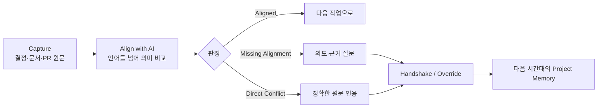

# Alignment Memory

> **결정은 번역되어도, 맥락은 쉽게 사라집니다.**

Alignment Memory는 다국어 분산 개발팀이 GitHub에 남긴 **결정과 새 Pull Request의 의미를 AI로 비교**하고, 충돌 근거와 사람의 최종 판단을 다음 협업자에게 이어 주는 프로젝트 메모리입니다.

[제품 실행](https://alignment-memory-fe.vercel.app) · [실제 Direct Conflict](https://github.com/gyutaetae/alignment-memory-be/pull/16#issuecomment-5360243431) · [공식 제출 페이지](https://likelion.community/competitions/central-hackathon/animal-league-3rd/projects/57f739ab-f0e8-4a92-ac71-8984ac5184dd?ref=projectss) · [Backend](https://github.com/gyutaetae/alignment-memory-be)

<p align="center">
  
</p>

## 심사위원을 위한 60초 검증

1. [한국어 결정과 영어 PR의 실제 충돌 판정](https://github.com/gyutaetae/alignment-memory-be/pull/16#issuecomment-5360243431)에서 `Direct Conflict`와 인용 근거를 확인합니다.
2. [Analyze 성공 실행](https://github.com/gyutaetae/alignment-memory-be/actions/runs/32413322000)에서 OpenAI 분석이 실제 완료됐는지 확인합니다.
3. [Publish 성공 실행](https://github.com/gyutaetae/alignment-memory-be/actions/runs/32413387501)과 [Live API](https://alignment-memory-be-production.up.railway.app/healthz)에서 게시 파이프라인과 배포 상태를 확인합니다.

`Direct Conflict` 체크의 실패 표시는 장애가 아니라 **기존 결정과 충돌하므로 병합을 막은 성공 결과**입니다.

## 문제: 번역 이후에도 결정의 이유는 남아 있는가?

[Atlassian의 2024 State of Teams](https://www.atlassian.com/blog/state-of-teams-2024)는 지식 근로자 5,000명과 Fortune 500 임원 100명을 조사해, 55%가 여러 앱에서 정보를 찾기 어렵고 56%가 팀마다 다른 업무 추적 방식 때문에 협업이 어렵다고 답했다고 보고합니다.

개발팀에서는 이 문제가 더 구체적입니다. 결정은 회의·문서·이슈에 남고 실제 변경은 PR에서 일어납니다. 언어와 시간대까지 달라지면 “무엇을 결정했는가”보다 **왜 그렇게 결정했는가**가 먼저 사라집니다.

첫 타깃은 **10–100명 규모의 다국어·분산 GitHub 개발팀**입니다. 이 타깃과 아래 가격 정책은 초기 시장 가설이며, 고객 인터뷰와 파일럿으로 검증해야 합니다.

## 제품 흐름: Capture → Align → Continue



- `Aligned`: 기존 목표·결정과 일치합니다.
- `Missing Alignment`: 판정에 필요한 의도나 근거가 부족합니다.
- `Direct Conflict`: 검증된 기존 결정과 의미상 직접 충돌합니다.

AI가 의미를 분석하고, 코드는 인용문이 원문에 실제 존재하는지 검증하며, 최종 결정은 사람이 `Handshake` 또는 근거 있는 `Override`로 남깁니다.

## 우리가 실제로 넘은 네 가지 경계

| 경계 | 실제 협업 사실 | 제품이 해결하는 방식 |
| --- | --- | --- |
| **지리** | 토론토·다낭·서울·도쿄의 비동기 협업 | 시간대·역할·담당 범위를 Context Passport로 인계 |
| **언어** | 한국어·영어·일본어·베트남어 사용 | 원문을 보존한 교차언어 의미 비교 |
| **문화** | 업무 시간과 직무별 소통 방식의 차이 | 국적을 추측하지 않고 사용자가 선택한 언어·역할만 사용 |
| **조직** | 한 팀 안의 PM·Frontend·Backend 책임 경계 | 결정·구현·검토·합의를 GitHub 근거로 연결 |

서로 다른 회사가 함께 썼다고 과장하지 않습니다. 이번 프로젝트가 실제로 넘은 조직 경계는 **한 해커톤 팀 안의 직무와 책임 경계**입니다.

## 실제 협업을 재현하는 데모 시나리오

1. 한국어로 “원문 사용자 메시지는 외부 분석 서비스에 저장하지 않는다”는 결정을 남깁니다.
2. 토론토 역할의 개발자가 영어로 raw prompt 외부 저장을 제안합니다.
3. OpenAI가 두 문장의 의미 충돌을 `Direct Conflict`로 분류하고 한국어 원문을 인용합니다.
4. 네 팀원이 같은 근거를 선택한 언어와 역할 맥락으로 확인합니다.
5. 사람이 질문·동의·교정 사유를 남겨 다음 시간대의 작업 근거로 보존합니다.

2–5번의 화면 역할 전환은 실제 팀 구성을 바탕으로 한 **데모 재연(role-play reenactment)**이며 네 명이 실시간 접속했다는 뜻은 아닙니다. GitHub PR·Actions·API 링크는 별도의 실제 실행 증거입니다.

## 제품 화면

아래 화면은 [공식 제출 페이지](https://likelion.community/competitions/central-hackathon/animal-league-3rd/projects/57f739ab-f0e8-4a92-ac71-8984ac5184dd?ref=projectss)에 제출한 제품 화면입니다. 화면 데이터는 안전한 Fixture이며, 위의 GitHub 링크가 외부 연동 성공 증거입니다.

### 1. GitHub 연결과 Initial Sync

<p align="center"></p>

### 2. Project Memory — 충돌과 다음 행동을 한눈에

<p align="center"></p>

### 3. Knowledge Graph — 목표·결정·작업·위험의 관계

<p align="center"></p>

### 4. Alignment Diff — 근거, Context Passport, Handshake

<p align="center"></p>

## AI가 장식이 아닌 이유

| AI가 수행 | 일반 코드가 검증 | 사람이 결정 |
| --- | --- | --- |
| 서로 다른 언어의 의미 비교 | 인용문이 저장된 원문에 정확히 존재하는지 | 동의·질문·반대 |
| 목표·결정·제약·책임 구조화 | 스키마·권한·중복·게시 경로 | AI 오판 교정 |
| 역할별 Context Passport 생성 | 이전 판정과 근거의 보존 | 기존 결정 대체와 사유 기록 |

단순 번역기는 문장을 옮기지만, Alignment Memory는 **과거 결정과 새 변경의 관계**를 찾습니다. 모델 결과가 검증을 통과하지 못하면 저장하거나 게시하지 않습니다.

## 차별성과 시장 진입 가설

| 대안 | 잘하는 것 | 남는 공백 | Alignment Memory |
| --- | --- | --- | --- |
| Wiki / 검색 | 문서 탐색 | PR 시점의 결정 충돌 판정 | 원문 근거와 변경을 자동 비교 |
| 번역기 | 언어 변환 | 프로젝트 의도·결정 관계 | 교차언어 의미 정합성 분석 |
| 코드 생성 AI | 구현 속도 | 조직의 장기 결정과 일치 여부 | merge 전에 근거 기반 판정 |

[GitHub는 2025년 1억 8천만 명 이상의 개발자와 월평균 4,320만 건의 merge된 PR](https://github.blog/news-insights/octoverse/octoverse-a-new-developer-joins-github-every-second-as-ai-leads-typescript-to-1/)을 보고했습니다. 이는 전체 시장 규모의 확정치가 아니라, GitHub 작업 흐름 안에서 해결할 문제가 충분히 넓다는 근거입니다.

- **Free 가설:** 공개 저장소 1개, 기본 Alignment 검사
- **Team 가설:** 저장소·좌석 기반 구독, 비공개 저장소와 팀 Passport
- **Enterprise 가설:** SSO, 감사 기록, 데이터 보존 정책, Jira·Linear·Slack 연동
- **검증 지표:** 충돌 사전 탐지 수, 재작업 시간, 신규 팀원 온보딩 시간, Handshake 완료율

## 실제 팀과 사실 경계

공식 제출 페이지에 확인되는 팀원은 **김지우(리더), 김세현, 모전민, 김규태**입니다. 세부 역할·기여 링크는 각 팀원이 직접 작성한 뒤 추가합니다.

- **실제 사실:** 네 지역에서의 비동기 협업, 네 언어 사용, 공개 GitHub 커밋·PR·Actions, 배포된 제품과 API
- **데모 재연:** 네 역할 전환과 한국어 결정–영어 PR 시나리오
- **제품 기능:** Passport 언어 전환, Alignment 판정, Handshake/Override
- **시장 가설:** 10–100명 팀 타깃, 요금제와 확장 채널

## 로컬 실행과 검증

요구 환경: Node.js `20.19+` 또는 `22.12+`

```bash
npm ci
VITE_FIXTURE_MODE=true npm run dev
```

`http://127.0.0.1:5173`에서 계정 없이 UI를 볼 수 있습니다. Live API 연결은 `.env.example`을 참고합니다. `VITE_FIXTURE_MODE=true`이면 API 주소가 있어도 Fixture가 우선됩니다.

```bash
npm run lint
npm test -- --run
npm run build
```

- [Backend repository](https://github.com/gyutaetae/alignment-memory-be)
- [5분 시연 영상 런북](./docs/demo-runbook.ko.md)

## 심사 기준 대응표

| 기준 | README와 제품에서 확인할 증거 |
| --- | --- |
| 문제 정의 25 | 외부 조사 수치, 구체적 타깃, GitHub 의사결정 단절 문제 |
| 실현 가능성 20 | 배포 UI·API, 실제 PR, Analyze/Publish 성공 실행 |
| 시장성 15 | 10–100명 팀부터 시작하는 PLG → Team → Enterprise 가설 |
| UI/UX 10 | 4개 핵심 화면과 충돌 → 근거 → 행동의 단일 흐름 |
| 전달력 10 | 60초 검증 동선과 5분 시연 런북 |
| 트랙 적합성 20 | 네 경계, AI의 의미 비교, 사람의 Handshake가 한 흐름으로 연결 |
